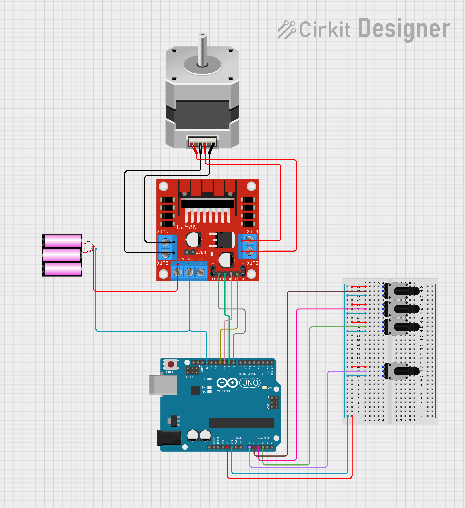

#  PID-Controlled Stepper Motor with Live Tuning (Arduino + L298N)

This project demonstrates a **real-time PID-controlled bipolar stepper motor** using Arduino, an L298N motor driver, and four potentiometers for dynamic tuning of position and PID gains.

---

##  Overview

The stepper motor's shaft position is dynamically controlled using a potentiometer. The system uses a PID algorithm to ensure smooth and accurate tracking. Three additional potentiometers allow for **live tuning of Kp, Ki, and Kd**, making it an interactive and educational demonstration of closed-loop control.

---

##  Hardware Used

| Component             | Details                                                                                       |
|----------------------|-----------------------------------------------------------------------------------------------|
| **Microcontroller**  | Arduino Uno                                                                                   |
| **Motor Driver**     | L298N Dual H-Bridge                                                                           |
| **Stepper Motor**    | [EM-483 bipolar stepper motor](https://www.instructables.com/EM-483-Specifications/) (5–6V, ~3.6Ω coils, ~1.4A max) |
| **Potentiometers**   | 4x 10kΩ (Position, Kp, Ki, Kd)                                                                 |
| **Power Supply**     | 5V–6V, capable of supplying 1.5A for the motor                                                |

...

##  References

- [EM-483 Stepper Motor Specifications – Instructables](https://www.instructables.com/EM-483-Specifications/)


---

##  Wiring Diagram

| Arduino Pin | Connected To            |
|-------------|-------------------------|
| D8–D11      | L298N IN1–IN4 (Motor)   |
| A0          | Position potentiometer  |
| A1          | Kp tuning pot           |
| A2          | Ki tuning pot           |
| A3          | Kd tuning pot           |
| 5V / GND    | All pots and L298N VCC  |

Below is the wiring diagram for the project (Arduino Uno + L298N + Stepper Motor + 4 Potentiometers):




---

##  PID Control Logic

The control system continuously:
1. Reads the desired position from a potentiometer.
2. Calculates the current error based on actual vs target steps.
3. Computes a PID output signal.
4. Converts the signal into a series of timed stepper motor pulses.
5. Updates the motor in real-time to minimize the position error.

### PID Formula:
```text
Output = Kp * error + Ki * ∫error + Kd * d(error)/dt
